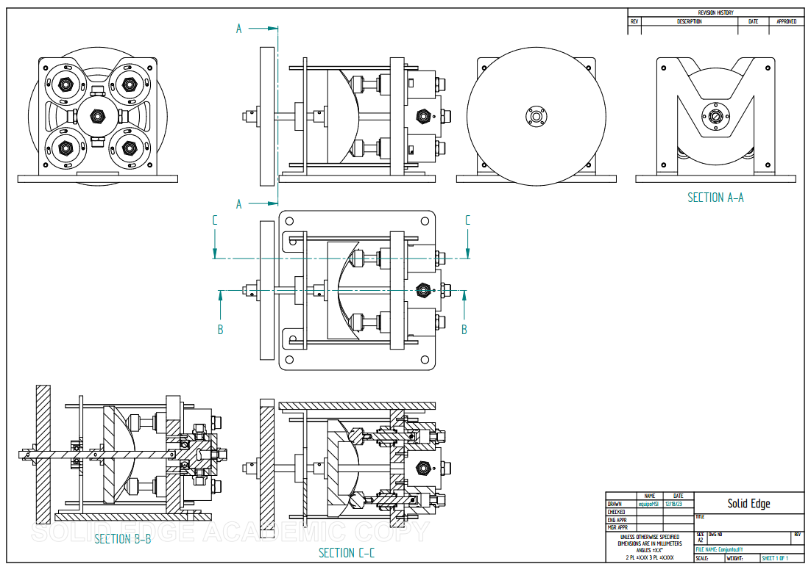
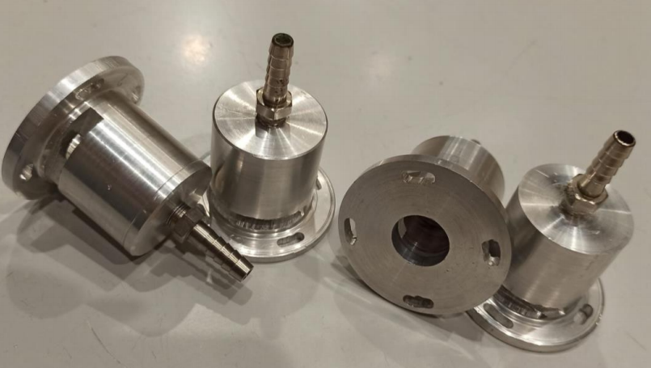
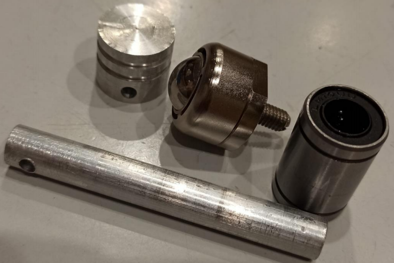
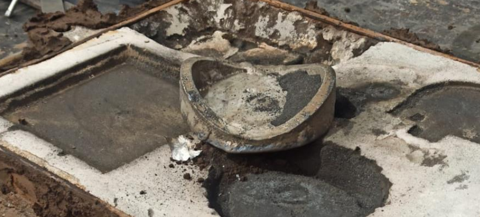
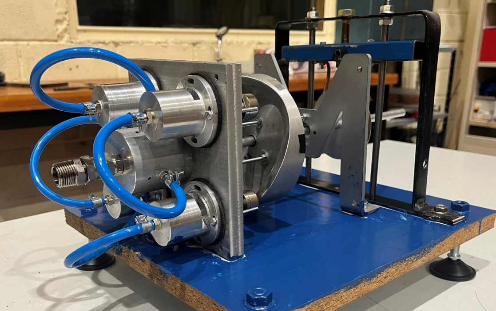

# 🛠️ Compressed Air Engine – Project Motor.ola

**Capstone Project** of my **Master of Science** in **Mechanical Engineering** at **Universidad Politecnica de Madrid**  
**Contributors:** Esteban Labrador de la Fuente, Inés Gadea, Manuel Candalija, Javier Barbero, Alberto Martínez, Antonio Treilhou  
**Date:** September 2023 – June 2024  
**Tools Used:** SolidEdge, MATLAB, Lathe, Milling Machine, Casting, Arduino (HX711, IR Sensor)

---

## 🚀 Project Overview

This project aimed to design and fabricate a **non-conventional compressed air engine** inspired by the opposed piston layout of the INNengine. The resulting prototype features a **4-cylinder, 2-stroke air-powered engine** with minimal vibration and a compact footprint. After three years of failed attempts in previous iterations, the 2023–2024 team successfully delivered a fully operational engine.

---

## 🧠 Mechanical Design

- **Layout:** Opposed twin 2-stroke pistons (4 cylinders total), radially arranged
- **Valve System:** Central rotary valve with radial air distribution
- **Transmission:** Custom camshaft-driven expansion
- **Materials:** Aluminum for lightweight components; steel for structural and moving parts
- **CAD:** Designed in SolidWorks with detailed mechanical drawings for each part
- **Innovations:**
  - Air recovery and venting holes to reduce cross-cylinder pressurization
  - Custom intake/exhaust valve with dynamic sealing
  - Adjustable tension and alignment system using elastic inserts and 3D printed guides

  

  <em>Technical drawings of the complete 4-cylinder compressed air engine, including piston layout, transmission, and valve system.</em>

---

## 🔧 Manufacturing Process

- **Machining:**
  - **Lathe:** Used for cylinders, pistons, connecting rods, cam, and valve housing. Each part was turned to tight tolerances (±0.1 mm).
  - **Milling:** Performed on the valve supports, mounting bases, and alignment flats.
  - **Drilling & Tapping:** Manual threading for pressure ports, bolt holes, and valve assembly.

  
  

  <em>Left: Cylinders  
  Right: Piston assembly with linear bearing and spherical follower.</em>

- **Casting:**
  - Aluminum casting was used for complex components such as the **cam** and the **cylinder-valve base support**.
  - Wooden patterns and sand molds were used; post-casting processing included **facing, polishing**, and **manual finishing** with files and sandpaper.

  

  <em>Cam after casting</em>

- **Assembly Adjustments:**
  - Rubber gaskets were added between cylinders and cast supports to compensate for machining tolerance errors.
  - Coca-Cola can metal was recycled as shims to stabilize bearing retainers—a creative fix that improved performance.
  - A unique piston-cylinder pairing system was used: each piston was manually fitted to its cylinder to account for minor dimensional deviations.

---

## 🖼️ Final Assembly

  

  <em>Final assembled compressed air engine, fully operational after multi-phase development.</em>

---

## 🧪 Instrumentation and Electronics

### 🔩 Torque & RPM Measurement

- **Prony Brake:** A custom-designed friction brake using a leather belt and aluminum drum mounted to the output shaft.
- **Load Cell + HX711:** Measures tension in the brake assembly and calculates torque via known arm length.
- **Proximity Sensor:** Detects revolutions using a reflective marker on the cam.

### 📟 Arduino System

- **MCU:** Arduino Mega 2560
- **Display:** 0.96” OLED screen + serial monitor logging
- **Functionality:**
  - Converts sensor data to live torque and RPM readouts
  - Updates every 5 seconds for averaged values
  - Data exported via USB to CSV for analysis

---

## 📊 Performance Results

- **Max Torque:** 1.3 Nm  
- **Max RPM:** ~354 RPM  
- **Peak Power Output:** ~12 W at ~100 RPM  
- **Expected (Design):** 2.2 Nm and 600 RPM ⇒ 50 W  
- **Limiting Factors:** Air leakage and manual startup reduced max achievable performance.

---

## 🧩 Challenges and Fixes

| Challenge                                 | Solution                                                                 |
|------------------------------------------|--------------------------------------------------------------------------|
| Air leakage in valve system              | Added sealing vents + improved valve fit                                 |
| Casting dimensional inconsistencies      | Used gaskets and shims to ensure alignment                               |
| Oversized cylinder bore (1/4 cylinders)  | Fabricated custom piston with matching diameter                          |
| Sensor instability in bright lighting    | Tuned IR proximity sensor sensitivity for lab environment                |

---

## 🔄 Proposed Improvements

- Replace manual startup with an electric or recoil system (e.g., chainsaw starter)
- Improve valve-to-body tolerances for better sealing and efficiency
- Re-machine mis-sized cylinders for uniform piston-air demand balance
- Add automated data logging with SD card or wireless module

---

## 📄 Project Reports

- [🧪 Mid-Project Report (Progress Review)](./Informe_Motorola.pdf)
- [📘 Final Report (Detailed Design, Build, and Testing)](./Informe_Junio.pdf)
---

> _This project embodies the full engineering cycle: from CAD design to machining, casting, assembling, troubleshooting, instrumentation, and performance testing. It reflects a hands-on, creative approach to building a working pneumatic engine system from the ground up._
